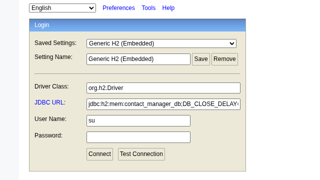

[](https://github.com/pcroch/spring-security/actions/workflows/jacoco_badge.yml)

[](https://github.com/pcroch/spring-security/actions/workflows/build.yml)

# Description


# Initial Set-up

## H2

you can connect via: http://localhost:8080/h2-console/

Using those settings: 



 Driver:
    
    org.h2.Driver

 URL:
    
    jdbc:h2:mem:contact_manager_db;DB_CLOSE_DELAY=-1;MODE=PostgreSQL
   

### Spring Boot

## Build the app

    mvn clean install

## Run the app

    mvn spring-boot:run

## Changing the port

In case of conflict with a port you can change the default port 8080 to the desire one in the respecting yml file

### How to fetch:

## Health Endpoint:

    curl http://localhost:8080/api/v1/health

## Should respond:

``` 
{ 
    "status": "UP"  
} 
```


